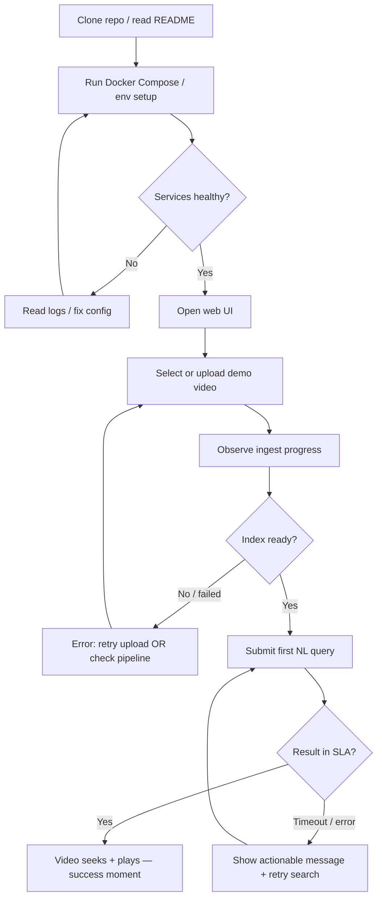
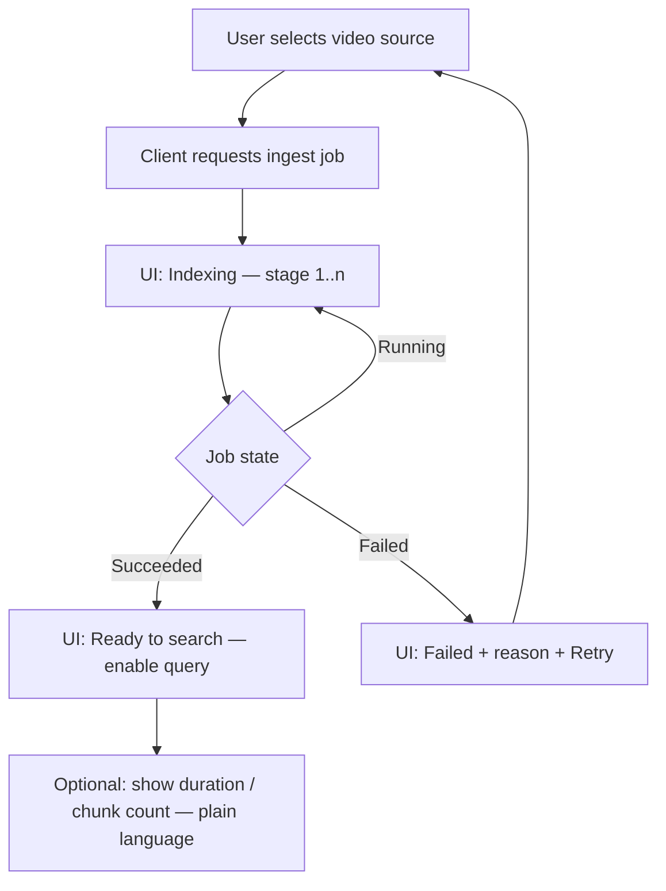
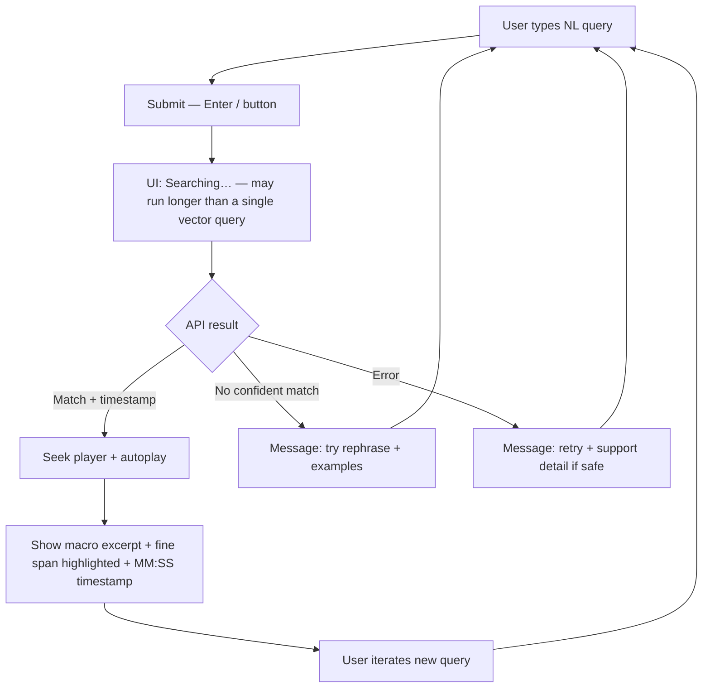

---
stepsCompleted:
  - 1
  - 2
  - 3
  - 4
  - 5
  - 6
  - 7
  - 8
  - 9
  - 10
  - 11
  - 12
  - 13
  - 14
lastStep: 14
uxDesignWorkflowCompletedAt: "2026-03-19T12:00:00Z"
uiLocale: fr-FR
inputDocuments:
  - _bmad-output/planning-artifacts/product-brief-semanticut-2026-03-17.md
  - _bmad-output/planning-artifacts/prd.md
---

# UX Design Specification semanticut

**Author:** Armand
**Date:** 2026-03-19

---

<!-- UX design content will be appended sequentially through collaborative workflow steps -->

## Executive Summary

### Project Vision

Semanticut is a proof-of-concept web app that turns a **natural-language memory** (“the part where they argue about the contract”) into a **concrete moment in a video**—seeking playback to the best-matching segment. The experience should feel **fast**, **trustworthy**, and **aligned with how people remember** (fuzzy scene recall vs. exact quotes). The POC is optimized for a **Mistral reviewer**: a **clean, reproducible** path from setup to **first successful search-and-jump**, while demonstrating an **end-to-end** pipeline (transcription, chunking, embeddings, vector retrieval).

### Target Users

- **Primary:** Technical **evaluators / reviewers** who need **clarity**, **predictability**, and **measurable** behavior (latency, timestamp quality).
- **Conceptual / emotional north star:** People who **revisit long videos** and remember **content**, not **timestamps**—they want to **land on the right scene** without **trial-and-error scrubbing**.

### Key Design Challenges

- **Search-to-playback SLA:** Meet the **~10s** “submit → video playing” expectation with **visible** system state, not a black box.
- **Trust in the jump:** **Quote-like** queries need **precision**; **vague** queries need **coherent scene starts** (no **mid-sentence** cuts), communicated as **intentional** behavior.
- **Ingestion transparency:** **Async** processing with **honest progress** and clear **ready / failed** states so users never wonder whether search is **safe to use**.
- **Reviewer-grade clarity:** **Minimal** UI that still **explains** what’s happening during **ingest** and **query**—enough for a **first-time** run through the repo.
- **French-only interface:** The **live product UI** must be **entirely in French** for the **reviewer** and **interview** context—see **Localization & UI language (French)**.

### Design Opportunities

- **A single memorable loop:** **Video → search → jump → play** as the **hero story** of the demo.
- **“Magic” moment:** When seek **lands correctly**, reinforce success with **immediate playback** and **tight** feedback.
- **Future-ready patterns:** Layout and flows that can later support **multiple hits**, **confidence**, and **history** without **rebuilding** the core loop.

## Localization & UI language (French)

### Requirement

- **MVP:** The **entire product UI** in the browser must be in **French** — **no** mixed **English** chrome (labels, buttons, navigation, **empty states**, **errors**, **ingest** stage names, **status** pills, **helper** text, **loading** messages, **aria-label** / **accessible** names where they surface to assistive tech).
- **Rationale:** The **Mistral reviewer** and the **interview** are conducted in **French**; the demo should feel **natural** and **credible** in that context without forcing **code-switching**.

### Scope

- **In scope (French):** All **user-visible** strings in the **Next.js** app, including **validation** messages and **onboarding** hints.
- **Query input:** Users **describe** scenes in **French** (or mixed language if the video is mixed) — the **placeholder** and **labels** are **French**; **do not** assume **English** queries for the demo narrative.
- **Out of scope (unless you decide otherwise):** **Repository** **README**, **API** **error** payloads aimed at developers, or **internal** logs — these may stay **English** for engineering clarity; **surface** only **user-safe**, **French** text in the UI (map **codes** to **French** copy).

### Implementation notes

- **Locale:** Target **`fr-FR`** for **copy**, **number**/**time** formatting (**MM:SS** with conventions users expect), and **date** formats if shown.
- **Typography:** Follow **French** typography habits where relevant (**espace insécable** before **`;` `!` `?` `:`** in polished copy — optional for MVP but **good** for perceived quality).
- **i18n:** Prefer **one** **French** **string table** (or **`next-intl` / JSON** **locales**) from day one so **no** **hard-coded** **English** **leaks** into **components**; even a **single-locale** app benefits from **centralized** strings and **review**.

### Example copy (reference — implement in app)

| Context | English (avoid in UI) | French (use) |
|--------|------------------------|--------------|
| Primary search prompt | “What moment are you looking for?” | *Quel moment cherchez-vous ?* / *Décrivez la scène à retrouver* |
| Search in progress | “Searching…” | *Recherche en cours…* |
| Successful jump | “Jumped to MM:SS” | *Saut à MM:SS* / *Lecture à partir de MM:SS* |
| Ready to search | “Ready to search” | *Prêt à rechercher* / *Index prêt* |
| Indexing | “Indexing” | *Indexation en cours* |

## Core User Experience

### Defining Experience

The defining experience is the **semantic jump**: the user **describes** what they remember in **plain language**, submits, and the **player seeks and plays** from a **credible** start time—**fast** enough to feel instant for a demo (**submit → playback** within the product’s latency goals). Everything orbits that loop: **pick the video** (when more than one exists), **wait until the index is ready** (with honest progress), then **search → jump → play** as the **hero path**. Secondary flows (upload/ingest, error recovery) exist only to **protect** that loop.

### Platform Strategy

- **Surface:** **Responsive web app** in the **browser**; **desktop-first** for the reviewer and typical demo.
- **Input:** **Keyboard-first** (query field, **Enter** to search); **pointer** for **video controls** and **file pick**.
- **Touch:** Treat as **progressive enhancement**—no MVP dependency on mobile gestures.
- **Connectivity:** **Online-only** POC—messaging should never imply offline search.
- **Environment:** Optimized for **Docker Compose** first run: copy, states, and empty states should support **someone who didn’t write the code**.

### Effortless Interactions

- **Clear readiness:** User always knows whether the **video is indexed and searchable** vs. **still processing** vs. **failed**.
- **Minimal cognitive load:** **One primary question** on the search screen — in **French**, e.g. *« Quel moment cherchez-vous ? »* — no mandatory advanced fields for MVP.
- **Immediate feedback after search:** **Seek + play** (or a **clear** “nothing useful found”) without making the user **interpret raw scores**.
- **Forgiving first run:** Sensible **defaults** and **labels** so the **reviewer path** (clone → up → ingest → query) doesn’t require tribal knowledge.

### Critical Success Moments

- **First successful jump** after setup: the **“this actually works”** proof for the reviewer.
- **Sub-10s search-to-playback** (per PRD): when it hits the bar, the product **feels** aligned with its promise; when it misses, **trust** erodes fast.
- **Right edge of the jump:** Quote-like queries feel **pinpoint**; vague queries feel like **entering the scene**, not **cutting a line in half**.
- **Ingest completion:** Transition from **background work** to **“you can search now”** is a **celebrated** state change, not a buried status.

### Experience Principles

1. **Protect the loop** — Every screen serves **describe → seek → play** or **unblocks** it (ingest, errors, readiness).
2. **State honesty** — **Never** look “ready” when search would **lie** or **fail**; **never** hide **blocking** errors.
3. **Latency is part of UX** — Design for **waiting** without **doubt**: **active** search feedback, no **dead air** without explanation.
4. **Reviewer-first clarity** — **Labels**, **empty states**, and **progress** should make **first-time** success **obvious**, not clever.
5. **Trust over chrome** — Prefer **plain**, **testable** UI over **decorative** complexity; the **magic** is the **correct timestamp**.

## Desired Emotional Response

### Primary Emotional Goals

- **Relief:** Freedom from **aimless scrubbing** and **guesswork**—“I described what I remembered, and it **took me there**.”
- **Confidence:** Belief that the **timestamp** and **start of playback** are **intentional** and **credible**, not random.
- **Respect (reviewer context):** The product feels **professionally built**—**clear**, **predictable**, and **measurable**—not flashy at the expense of honesty.
- **Quiet delight:** A small **lift** when the **first jump works** or a **hard query** still lands well—**restraint** over hype.

### Emotional Journey Mapping

- **Discovery / first run:** **Oriented** and **reassured**—purpose and **next step** are obvious (especially under **Docker Compose** / first clone).
- **During ingest:** **Calm patience** supported by **visible progress** and **plain-language** stages—never **opaque** waiting.
- **During search:** **Focused anticipation**—short wait is acceptable if the UI signals **active work** (not a frozen page).
- **After a good jump:** **Satisfaction** and **trust**—reinforced by **immediate playback** from a **sensible** start point.
- **After a miss or error:** **Supported**, not **blamed**—actionable messaging (**retry**, **new upload**, **rephrase**) with a **steady** tone.
- **Returning:** **Familiar competence**—same **hero loop**, low re-learning cost.

### Micro-Emotions

| Pair | Priority for semanticut |
|------|-------------------------|
| **Trust ↔ Skepticism** | **Highest** — the product is selling **semantic truth**; skepticism kills the demo. |
| **Confidence ↔ Confusion** | **High** — especially around **index readiness** and **what just happened** after search. |
| **Excitement ↔ Anxiety** | **Moderate** — excitement on **first success**; anxiety if **latency** or **silence** feel **risky**. |
| **Accomplishment ↔ Frustration** | **High** — **first successful jump** should feel like a **win**; **opaque failures** create **frustration** fast. |
| **Delight ↔ Satisfaction** | **Target: satisfaction first** — **delight** is **optional garnish** after **reliability**. |

### Design Implications

- **Relief** → Prioritize **one obvious primary action** (search) and **minimize** secondary noise on the **happy path**.
- **Confidence** → Always show **system state** (**ready / busy / error**); after search, prefer **playback + context** over **mysterious jumps**.
- **Respect** → Use **precise, modest copy**; avoid **overpromising** (“perfect,” “instant”) where **SLAs** are **targets**, not guarantees.
- **Quiet delight** → **Micro-feedback** on success (**brief** confirmation, smooth **seek**) without **celebratory clutter**.
- **Avoid** → **Dead air**, **false readiness**, **jargon-heavy** errors, **blame-the-user** wording (“invalid query”) without guidance.

### Emotional Design Principles

1. **Trust before sparkle** — **Honest states** and **credible results** beat **clever animation**.
2. **Patience with visibility** — Waiting is fine when **progress** is **legible**; **silence** is not.
3. **Celebrate the first jump** — Treat **first successful seek** as the **emotional proof** of the product.
4. **Fail gracefully** — Errors should **restore agency** (**what happened**, **what to do next**).
5. **Tone: calm expert** — **Assured**, **plain**, **slightly technical** where it helps the reviewer—never **chaotic** or **cute** at the cost of clarity.

## UX Pattern Analysis & Inspiration

### Inspiring Products Analysis

*Reference analogs* (common patterns, not a mandated brand list):

| Reference | What they get right (UX) | Relevance to semanticut |
|-----------|---------------------------|-------------------------|
| **Modern video players** (e.g. YouTube-style) | **Scrubber + play/pause + time readout**; seek is **one clear affordance**; fullscreen optional. | **Playback is the reward** after search—**player chrome** should stay **familiar**. |
| **Query → result UIs** (e.g. search / “answer” products) | **Single prominent query box**; **loading** state; **one primary result** with optional alternates later. | Mirrors **one NL query → one best jump** for MVP. |
| **Issue trackers / CI-style apps** (e.g. Linear-style clarity) | **Status** is **legible** (queued / running / done); **errors** are **actionable**; **dense but calm** layout. | Maps to **async ingest** and **reviewer-grade** seriousness. |
| **Upload + processing flows** (cloud consoles, large-file UIs) | **Progress** tied to **stages**; **non-blocking** UI; **retry** paths. | Directly supports **transcription → chunk → embed** with **honest** progress. |
| **Launcher / spotlight-style search** | **Keyboard-first** entry; **minimal** UI until you ask. | Reinforces **“type what you remember”** as the **center of gravity**. |

### Transferable UX Patterns

**Navigation & hierarchy**

- **Single primary column:** **Video + player** above the fold; **search** as **persistent** or **obvious**—avoid **hunting** for the query box after ingest.
- **State-driven chrome:** **Readiness** (not indexed / indexing / ready / error) **gates** or **labels** the search affordance—same pattern as **disabled until ready** in dashboards.

**Interaction**

- **Query → working → result** triad: **Submit** → **active search state** (spinner + “Searching…” + optional **elapsed time**) → **seek + autoplay** (or **empty / low-confidence** copy for MVP).
- **Enter to submit** in the query field; **Space** on player for play/pause—**no novelty** for basic playback.

**Visual / feedback**

- **Restrained palette + clear focus ring** on the query field—**trust** reads as **clean**, not **flashy**.
- **Subtle success:** **Brief** “Jumped to **MM:SS**” or inline **timestamp** near the player—**confirms** the system **did something concrete**.

### Anti-Patterns to Avoid

- **Mystery meat video** — Player visible but **unclear** whether search is **allowed**; user **tries** queries and **nothing** happens.
- **Fake progress** — Indeterminate bars with **no stage text** during **long** ingest; erodes **trust** (conflicts with **Desired Emotional Response**).
- **Scoreboard UI** — Exposing **raw similarity scores** without **plain explanation**; reviewers read it as **fragile** or **debuggy**.
- **Scrubbing as primary** — Leaning on **manual timeline** to **fix** bad jumps; contradicts the **semantic** promise for the POC story.
- **Over-wizarding** — Too many **mandatory** steps before **first search**; hurts **time-to-first-success**.

### Design Inspiration Strategy

**Adopt**

- **Familiar player controls** + **time display** — reduces **cognitive load**; supports **trust** (“I see where I landed”).
- **Dashboard-honest async** — **staged** ingest with **retry**; matches **emotional** goal of **patience with visibility**.
- **Search-first entry** — **One field, one button**, **keyboard path**—protects the **core loop**.

**Adapt**

- **“Ten blue links” search** → **One best timestamp** for MVP; **no** clutter of **ranked lists** until **post-MVP** multi-hit UX.
- **Heavy media sites** → Strip **recommendations**, **comments**, **social**—**single-video focus** for the POC.

**Avoid**

- **Gamified** or **cute** copy that undermines **reviewer** tone.
- **Dark patterns** (e.g. hiding **failure**)—conflicts with **state honesty** and **respect**.

## Design System Foundation

### 1.1 Design System Choice

**Primary stack:** **Tailwind CSS** for layout, spacing, and typography; **shadcn/ui** (built on **Radix UI** primitives) for interactive components (buttons, inputs, dialogs, progress, alerts).

**Classification:** **Themeable system** (not a fully custom design system from scratch, not a rigid “one look” library like Material out of the box).

### Rationale for Selection

- **Next.js alignment:** Fits the **React / Next** POC described in the PRD; large community and examples for **App Router**-style apps.
- **Speed + consistency:** Delivers **polished defaults** (focus rings, disabled states, form labels) so the MVP reads as **intentional**, not **prototype-rough**.
- **Accessibility:** Radix primitives support **keyboard** and **screen reader** expectations—supports **trust** and **reviewer** credibility.
- **Visual restraint:** Easy to keep a **neutral, “tool”** aesthetic (dashboard + player) without **marketing-site** chrome—matches **emotional** and **experience** principles.
- **Ownership model:** Components live **in your repo** (not only `node_modules` black boxes), which helps when you need **custom** video player layout or **ingest** status UI.

### Implementation Approach

- **Install and configure** Tailwind for the Next.js app; add **shadcn/ui** with a **default** (or **slate/zinc**) neutral palette.
- **Compose screens** from primitives: **Page shell** (max-width column), **Card** for “video + ingest” and “search,” **Input** + **Button** for query, **Progress** for staged ingest, **Alert** / **inline error** for failures.
- **Reserve custom components** for: **video player** (HTML5 `<video>` + **controls** styling), **timeline** scrubber (if shown), and any **timestamp** / “jumped to” display.
- **Tokens:** Define **CSS variables** (via Tailwind theme or shadcn theme) for **radius**, **border**, **foreground/background**, and **semantic colors** (success, warning, destructive) so **states** (ready / indexing / error) stay **consistent**.

### Customization Strategy

- **Brand:** Stay **neutral** for the POC—**one accent** (e.g. primary button + focus) is enough; avoid **loud** gradients that compete with **video content**.
- **Density:** Prefer **slightly compact** forms and status rows (reviewer / dev-tool feel), with **comfortable** line height in body copy.
- **Component overrides:** Use **shadcn** patterns for **forms** and **feedback**; **custom-build** only what’s **video-specific** (player chrome, optional waveform later).
- **Future-proofing:** If you later add **multi-result** or **history**, extend the same **Card** / **List** patterns rather than introducing a second UI family.

## 2. Core User Experience

### 2.1 Defining Experience

The defining experience is **“describe the moment in plain language → get taken to that moment in the video.”** In one sentence users might repeat: **“I type what I remember, and it jumps me there.”** If we nail **search → seek → autoplay** with **honest** readiness and **credible** timestamps, the POC **succeeds**; everything else is **supporting cast**.

### 2.2 User Mental Model

- **Today:** Users **scrub** timelines, **guess** timestamps, or **keyword-hunt** if metadata exists—high **friction**, low **trust**.
- **What they bring:** Familiarity with **search boxes** (query → result) and **players** (time, play/pause).
- **Expectation:** “If I describe what was said or happening, the app should **find that part** and **start playing there**”—not return a wall of **raw text** without **playback**.
- **Confusion risks:** Thinking search applies **globally** (wrong scope), **not knowing** the video is **still indexing**, or **interpreting** vague results as **random**—mitigated by **state**, **labels**, and **timestamp** feedback.

### 2.3 Success Criteria

- **“It just works”** — After **submit**, the user **sees active search**, then **video seeks** and **plays** from a **believable** start—without **debug** numbers or **silent** failure.
- **Feels fast** — **End-to-end** from **submit** to **playback** meets the **≤ ~10s** product target on representative hardware; **perceived** speed is supported by **visible** progress (not a **frozen** UI).
- **Feels right** — **Quote-like** queries land **within ±5s** of the intended line; **vague** queries land at a **scene-coherent** start (not **mid-sentence**), per product rules.
- **Automatic** — Once a match exists, **seek + play** happen **without** extra confirmation steps in MVP.

### 2.4 Novel UX Patterns

- **Pattern mix:** **Established** patterns dominate—**single-line query**, **submit**, **HTML5 video**, **time readout**. **Novelty** is **under the hood** (vector retrieval + chunking), not **new gestures**.
- **Education:** Minimal—**scope** (“this video”) and **readiness** (indexed vs not) are the **main** concepts to **teach** through **UI**, not a **tutorial**.
- **Unique twist:** **Search-first** layout with **player as proof**—the **result** is **playback**, not a **link** or a **detached** one-line snippet: when **multi-scale** search is used, pair **playback** with a **macro** transcript block and the **fine** span **highlighted** inside it (see **`JumpFeedback`**).

### 2.5 Experience Mechanics

**1. Initiation**

- User **selects** or **uploads** a video (per MVP scope); system **ingests** asynchronously.
- User **starts** the core action when the UI shows **searchable / ready** (primary **query field** enabled).

**2. Interaction**

- User **types** a natural-language description in the **query field**; **Enter** or **Search** submits.
- System **embeds** query, **retrieves** best chunk, maps to **timestamp**, **seeks** player, **plays** (MVP: **one** best result).

**3. Feedback**

- **While searching:** **Non-blocking** “Searching…” state (spinner + **short** copy); optional **elapsed** time if waits approach **SLA** limits.
- **On success:** **Visible** seek + **playback**; optional **inline** “Jumped to **MM:SS**” (or **range**) to **anchor** trust.
- **On failure / low confidence:** **Plain** message + **retry** / **rephrase**—no **raw scores** unless **explicitly** in debug mode. If match strength is shown, prefer **tiered labels** (e.g. strong / partial) or **relative** cues over a **numeric percentage** that reads as precise when the model cannot support it.

**4. Completion**

- **Success** = **video playing** from the **returned** start; user can **iterate** with a **new query** (same loop).
- **Next:** If ingest was **blocking**, transition to **ready** state; **post-MVP** could add **history** or **multiple candidates** without changing the **core** mechanic.

## Visual Design Foundation

### Color System

- **Base theme:** **Neutral “tool” UI** — prefer **zinc** or **slate** scale for **background**, **surface** (cards), **border**, and **foreground** (shadcn defaults align well).
- **Semantic mapping:**
  - **Primary** — **one** accent for **Search** / **focus rings** / **key CTAs** (muted **blue** or **violet**; avoid **neon**).
  - **Success** — **ingest complete** / **ready to search** (subtle **green** tint or icon + text, not loud banners).
  - **Warning** — **degraded** or **slow** paths (optional for POC).
  - **Destructive** — **failed ingest** / **unrecoverable** error.
- **Video area:** Prefer **true black** or **near-black** behind **video** (letterboxing) to avoid **competing** saturation with **primary** chrome.
- **Contrast:** Target **WCAG AA** for **body text** and **interactive** labels on **default** surfaces; **verify** **primary** on **filled** buttons.

### Typography System

- **Tone:** **Professional, calm, slightly technical** — matches **reviewer** audience and **dashboard** patterns.
- **Faces:** **System UI stack** or **Inter** (via `next/font`) for **UI**; **optional** **mono** for **timestamps** / **debug** (if exposed) to signal **precision**.
- **Scale:** **Single clear hierarchy** — **page title** (lg/semibold), **section labels** (sm/medium), **body** (sm or base, relaxed **line-height** for **readability**), **captions** for **helper** text under **search** and **status**.
- **Content load:** **Mostly short** strings (**labels**, **status**, **errors**); **no** long-form reading—keep **line length** **comfortable** in the **main column** (max-width ~ **640–720px** for **text** blocks).

### Spacing & Layout Foundation

- **Unit:** **4px** base via Tailwind (**1 = 4px**); default to **8px** (**2**) as the **smallest** vertical rhythm between **related** items.
- **Density:** **Slightly compact** for **forms** and **status rows** (**reviewer** feel); **generous** **padding** inside **cards** (**p-4** / **p-6**) so the **player** and **search** **breathe**.
- **Grid:** **Single-column** **primary** layout on **desktop**; **optional** **two-column** later for **transcript**—MVP stays **one column** (**video** → **ingest** → **search**).
- **Principles:**
  - **Video first** — **Player** gets **priority** vertical space; **search** is **one** **obvious** band below or beside (width permitting).
  - **Predictable alignment** — **Left-align** **form** edges; **consistent** **gaps** between **sections** (**gap-6** / **gap-8**).
  - **Stable chrome** — **Header** / **status** don’t **jump** height; use **reserved** space for **progress** to avoid **layout shift**.

### Accessibility Considerations

- **Focus:** **Visible** **focus rings** on **inputs** and **buttons** (Radix/shadcn defaults + **token** check).
- **Keyboard:** **Tab** order follows **visual** order: **video** (if focusable controls) → **query** → **submit**; **Enter** submits from **query**.
- **Color + icon:** **Never** rely on **color alone** for **state** — pair **Ready / Indexing / Error** with **text** + **icon**.
- **Motion:** Avoid **parallax** or **heavy** animation; **respect** **`prefers-reduced-motion`** for **transitions**.
- **Video:** Provide **keyboard-accessible** **controls** where **native** **HTML5** allows; ensure **captions** path is **considered** if you add **caption** tracks later (post-MVP).

## Design Direction Decision

### Design Directions Explored

Eight static directions were produced in `ux-design-directions.html`:

1. **Single-column light canvas** (recommended) — neutral tool UI, video-first, search band below.
2. **Dark “developer console”** — low-glare, deep video well; strong “infra” feel.
3. **Split panel** — video + side column for context / future transcript or match snippet.
4. **Dense operations** — tight paddings for **status-heavy** screens.
5. **Soft indigo atmosphere** — slightly warmer chrome, still professional.
6. **Strong indigo accent** — higher-chroma primary CTA for **demo-at-a-distance** visibility.
7. **Wireframe / high-contrast** — borders over shadows for **structure-first** iteration.
8. **Narrow mobile column** — stacked **video → query → action** for mobile-first checks.

### Chosen Direction

**Direction 1 — Single-column light canvas** as the default for MVP implementation.

### Design Rationale

- **Matches emotional goals:** calm, credible, **trust-before-sparkle**; avoids **marketing-heavy** gradients.
- **Matches core loop:** **video** dominates; **search** is **one** obvious band—protects **describe → seek → play**.
- **Matches design system:** **shadcn/ui + Tailwind** defaults map cleanly to **zinc/slate** surfaces and **WCAG AA**-friendly text.
- **Reviewer-friendly:** reads as a **serious** tool, not a **prototype skin**—supports **first-run** success and **measurable** SLAs.

### Implementation Approach

- **Implement Direction 1** in the Next.js app: **single centered column** (max-width ~ **1024–1200px**), **Card** for video + player chrome, **Card** or **section** for search.
- **Reserve** Direction **3** for later if **transcript / match snippet** ships: add a **second column** at `lg` breakpoint without changing **mobile** stack (Direction **8** informs **narrow** layout).
- **Optional theme toggle** to Direction **2** (dark) can be a **post-POC** enhancement if **user testing** prefers low-glare—keep **tokens** centralized so swapping is easy.

## User Journey Flows

PRD-aligned stories emphasize a **Mistral reviewer** path (**reproducible** setup) and a **core loop** (**natural-language** query → **timestamp** → **playback**). The flows below turn those stories into **interaction mechanics** and **recovery** paths.

### First-run reviewer (time-to-first-success)

**Goal:** From **cold start**, reach **“video indexed + first query returns playback”** without tribal knowledge.

**Notes:** README and **empty states** should mirror **D→E**; **F** must show **stage** + **percent**; **H** must be **specific** (not “Error 500” only).

### Video ingest to “ready to search”

**Goal:** User **trusts** that **async** work is **real** and knows **when** search is **safe**.

**Notes:** **Disable** search until **E**; **never** imply **E** while **D** is still running.

### Semantic search → jump (core loop)

**Goal:** **Describe → seek → play** with **visible** work and **credible** landing.

**Notes:** **MVP** = **one** best match; **post-MVP** can branch **D** into **multiple candidates** without changing **A→C**.

### Journey patterns

- **State-gated primary action:** **Search** only when **Ready** (same pattern as **disabled** until **ingest** completes).
- **Progressive disclosure:** **Technical** detail (**stages**) on **ingest**; **no raw scores** on **search** for MVP. When **multi-scale** retrieval is used (hybrid macro retrieval + **LLM** direct timestamp extraction), make the outcome **legible** in the UI: show the **full macro** (coarse context) and **highlight** the **fine / micro** span inside it — **trust** comes from **context + precise span**, not a fake-precision **percentage**. The **Searching…** state may last **slightly longer** than a naive single embedding search; keep **active** feedback (spinner / disabled submit) so the wait never feels **frozen**.
- **Consistent recovery:** **Retry** on **transient** failures; **re-upload** on **persistent** ingest failure; **rephrase** on **weak** retrieval.
- **Feedback triad:** **Working** → **success with anchor** (`MM:SS`) → **actionable** **failure**.

### Flow optimization principles

- **Minimize steps to first value** — **one** video, **one** query path; avoid **extra** modals on MVP.
- **Reduce cognitive load** — **single** primary question: *What moment are you looking for?*
- **Make waiting legible** — **ingest** and **search** both show **active** progress, not **frozen** UI.
- **Design for failure** — **assume** **timeouts** and **bad** files; **preserve** **agency** with **next steps**.

## Admin — video registration (upload form)

**Goal:** An **admin** can **register** a new video for ingestion **from the admin surface** without using `curl` or external API clients — supporting the **reviewer path** and **Story 2.5**.

**Placement:** Same **admin** route as the video list (**Story 2.2**): a **dedicated section** (for example above the table) so **register** and **monitor** are clearly related.

**French (required):** All **labels**, **buttons**, **validation**, **helper** text, **`aria-label`s**, and **user-visible** error summaries — consistent with **Localization & UI language (French)**.

**Controls:**

- **File:** Native **file input** (optional **drag-and-drop** later); **accept** video types aligned with the API.
- **Fields:** **Label** (or other required metadata) per **`POST /videos`** contract.
- **Primary action:** Submit — **disabled** while the request is in flight; **loading** state visible.

**Feedback:**

- **Success:** New row appears in the admin list on next **poll** or refresh (**Story 2.2**), or **inline** confirmation before list update.
- **API errors:** Map `{ "error": { code, message } }` to **French** copy; **no** internal stack traces in the UI.

**Patterns:** Reuse **shadcn** form primitives, **`Alert`** for failures, same **secondary** button weight as other non–hero-path actions (see **Button hierarchy**).

## Component Strategy

### Design System Components

**From shadcn/ui + Tailwind (use off-the-shelf):**

| Area | Components |
|------|------------|
| **Layout** | `Card`, `Separator`, `ScrollArea` (if needed), container / stack utilities |
| **Forms** | `Input`, `Label`, `Button`, `Textarea` (only if long queries), form patterns with React Hook Form if desired |
| **Feedback** | `Alert`, `Skeleton` (optional), `Progress` (ingest), `Badge` / pills for status |
| **Overlays** | `Dialog` or `Sheet` for errors with long detail; `Tooltip` for subtle hints |
| **Navigation** | Simple **header** row (text + status)—no complex nav for MVP |

**Gap:** None of these alone express **video + seek semantics**, **multi-stage ingest**, or **“jumped to MM:SS”** as a **first-class** pattern—those become **custom** compositions below.

### Custom Components

#### `SemanticVideoPlayer` (composition)

**Purpose:** Present **video** with **familiar** controls and a **stable** slot for **time readout** / **jump feedback** aligned to Direction 1.  
**Usage:** Main **canvas** on the home/search view; **one** instance per active video (MVP).  
**Anatomy:** **`<video>`** + **custom control bar** (or styled native controls policy) + **optional** **timestamp strip** / **live** current time (**tabular** numerals).  
**States:** `loading` (metadata), `ready`, `playing`, `paused`, `seeking`, `error` (codec / source).  
**Variants:** **Compact** bar vs **minimal** chrome for small widths.  
**Accessibility:** **Keyboard** focus on **play** control; **ARIA** labels for **play/pause**; **announce** seek completion if implementing a **live region** (optional).  
**Content:** **No** marketing overlays on the **video** surface for MVP.  
**Behavior:** Exposes **imperative seek** (`currentTime`) from parent when search returns.

#### `IngestStatusPanel`

**Purpose:** Make **async** pipeline **legible** (trust) and **gate** search.  
**Usage:** Below upload / video selection; visible whenever a job exists or **in progress**.  
**Anatomy:** **Title** (“Indexing”) + **Progress** (determinate if API exposes %) + **stage list** (text: e.g. extract audio → transcribe → chunk → embed) + **inline** **Alert** on failure.  
**States:** `idle` (no job), `queued`, `running`, `succeeded` (**enables** search), `failed` (**retry**).  
**Variants:** **Collapsed** one-liner vs **expanded** stages (default **expanded** for POC credibility).  
**Accessibility:** **role="status"** or **live region** for **stage** changes; **don’t** rely on **color** alone for **failed**.  
**Behavior:** Emits **onReady** when **succeeded**; **Retry** returns user to **select/upload** or **restarts** job per API.

#### `SemanticSearchBar`

**Purpose:** **Single** **hero** input for **NL** query with **Enter** to submit.  
**Usage:** **Enabled** only when **ingest** **succeeded** (or **disabled** with **helper** explaining why).  
**Anatomy:** `Label` + `Input` + **primary** `Button` (e.g. **« Rechercher »**) + **optional** **hint** line — **all** **copy** in **French** per **Localization & UI language**.  
**States:** `disabled` (not ready), `empty`, `typing`, `submitting` (**loading** on button / inline spinner), `error` (validation / API).  
**Accessibility:** **`<label>`** for input; **button** **disabled** during **submit**; **aria-busy** on form while searching.  
**Behavior:** **Enter** submits; **debounce** optional for analytics only—not for search **execution** in MVP.

#### `JumpFeedback` (inline)

**Purpose:** **Anchor trust** after a match—**“Jumped to MM:SS”** plus, when **multi-scale** search is available, a **result excerpt** that shows **macro context** with the **fine match highlighted** inside it (not the micro snippet alone).  
**Usage:** Between **player** and **search** or adjacent to **time** readout.  
**Anatomy:** **Timestamp** line (trust anchor) + **paragraph** for **macro** transcript with **`<mark>`** or styled **span** around the **micro** span (distinct background; not **color-only**); **no** misleading **numeric similarity %** as the primary trust signal — **tiered** or **relative** feedback if needed (see **On failure / low confidence** above).  
**States:** `hidden` (no successful jump yet), `visible` (last jump), `cleared` on new search start (optional).  
**Accessibility:** **aria-live="polite"** on success update so **screen reader** users hear the **timestamp**; associate the **highlight** with a short **French** label if needed (e.g. **« passage correspondant »** via **`aria-describedby`**).

### Component Implementation Strategy

- **Compose** custom blocks from **shadcn** primitives and **shared** **Tailwind** utilities; **avoid** a second **visual** language.
- **Centralize** **state**: **ingest** and **search** **loading** use the same **spinner / disabled** patterns as **Button** + **Progress**.
- **Keep** **video** behavior in a **thin** wrapper—**no** business logic in **presentational** pieces beyond **props** and **callbacks**.
- **Tokens:** Use **semantic** colors for **success / destructive / warning** from **Visual Design Foundation** for **Alert** and **status** pills.

### Implementation Roadmap

**Phase 1 — MVP-critical**

1. **`IngestStatusPanel`** + **`SemanticSearchBar`** (with **gating**) — unblocks **first-run** journey.  
2. **`SemanticVideoPlayer`** + **`JumpFeedback`** — completes **core loop**.

**Phase 2 — Hardening**

- **Empty states** and **error** `Dialog`s for **opaque** failures.  
- **Skeleton** placeholders for **player** while loading **metadata**.

**Phase 3 — Post-MVP**

- **Result list** / **candidates** panel (extends **`JumpFeedback`** area or **split** layout from Direction 3).  
- **History** of queries ( **`ScrollArea`** + list primitives).  
- **Debug** panel (optional)—**mono** timestamp, chunk id—**behind** feature flag.

## UX Consistency Patterns

### Button Hierarchy

- **Primary:** **Search** (UI label **« Rechercher »** or equivalent) — **one** filled **primary** per view for the **core** action; use **shadcn** `Button` **default** variant. **All** **visible** **text** **French**.
- **Secondary:** **Upload** / **Choose file** / **Retry** — **outline** or **secondary** variant; never **outshine** **Search** on the **main** screen.
- **Tertiary / ghost:** **Cancel** (rare in MVP), **Dismiss** on dialogs, **icon-only** **play** on player (with **aria-label**).
- **Destructive:** Only for **irreversible** actions (e.g. **delete** video index if ever added)—**confirm** in **Dialog**; **not** used for **normal** retry paths.

### Feedback Patterns

- **Success (non-blocking):** **JumpFeedback** line + **timestamp**; **avoid** toast **spam** for every seek—**inline** is enough.
- **In progress:** **Progress** + **stage labels** for **ingest**; **inline** spinner + “Searching…” for **query**—same **visual** language for **waiting**.
- **Warning:** **Yellow/amber** `Alert` for **degraded** behavior (e.g. slow machine)—**action** optional (“Continue waiting”).
- **Error:** `Alert` **destructive** variant + **short** title + **what to do next**; **long** stack traces **behind** “Details” in **Dialog** if needed for **reviewers**.
- **Info:** **Muted** text or **blue** `Alert` for **scope** (“Searching **this** video only”) on **first visit** or **empty** query box.

### Form Patterns

- **Single field MVP:** **Label** always visible; **placeholder** is **hint**, not **label** (accessibility).
- **Validation:** **Inline** below **input** on **submit** with **empty** query; **don’t** block **typing** with **aggressive** red until **submit**.
- **Disabled search:** When **not ready**, **disable** **Search** and show **helper** text (“Finish indexing first”)—**same** pattern as **disabled** primary in dashboards.
- **Submit:** **Enter** = submit from **query**; **double-submit** **prevented** while **`isSearching`**.

### Navigation Patterns

- **MVP:** **Single-page** **hero** flow—**no** **sidebar** nav; **header** = **product name** + **global** **status** pill (**Ready** / **Indexing** / **Error**).
- **Future:** Add **library** or **history** as **top nav** or **secondary** **tabs**—keep **search** **in** **main** column.

### Additional Patterns

- **Loading / skeleton:** **Skeleton** for **player** **metadata** load; **avoid** **layout shift** in **IngestStatusPanel** by **reserving** **min-height** for **stage** list.
- **Empty states:** **First run** — **Upload** CTA + **1–2** line **value** prop; **no** **dummy** video **until** user acts.
- **Modals:** Use **sparingly**—**confirm** **destructive** actions; **optional** **error** **details**; **focus trap** and **Esc** to close per **Dialog** defaults.
- **Search-specific:** **No** **filters** in MVP; **one** **query** field = entire **search** pattern. **Post-MVP:** **filters** become **advanced** **collapsible** block.

**Design system integration:** Patterns map to **shadcn** **Button**, **Alert**, **Progress**, **Dialog**, **Input**, **Label**—custom compositions (**SemanticSearchBar**, etc.) **arrange** primitives and **encode** **gating** rules.

## Responsive Design & Accessibility

### Responsive Strategy

- **Desktop (primary):** **Single** centered **column** (~1024–1200px max width); **extra** horizontal space becomes **margin**, not **more** columns (MVP). **Video** gets **maximum** readable width; **optional** **two-column** (Direction 3) only **post-MVP**.
- **Tablet:** Same **column** as desktop; **increase** **tap** targets; **avoid** **hover-only** affordances for **critical** actions.
- **Mobile:** **Stack** **video → status → search**; **full-width** **primary** **Search** button; **header** stays **minimal**; **no** **sidebar**.

### Breakpoint Strategy

- **Approach:** **Mobile-first** utilities (Tailwind), **add** **horizontal** **breathing room** at **`sm` / `md` / `lg`**.
- **Suggested breakpoints (Tailwind-aligned):** **`sm` 640px** — comfortable **padding**; **`md` 768px** — **two-line** **header** if needed; **`lg` 1024px** — **max-width** **shell** + **optional** **split** later.
- **Player:** **16:9** **container** **max-width** **100%**; **letterbox** with **neutral** **background** (per **Visual Design Foundation**).

### Accessibility Strategy

- **Target:** **WCAG 2.2 Level AA** for the POC UI (default **shadcn/Radix** patterns help).
- **Contrast:** **Body** and **UI** text **≥ 4.5:1** on **default** surfaces; **large** text **≥ 3:1**; **verify** **primary** **filled** buttons.
- **Keyboard:** **Visible** **focus**; **logical** **tab** order (**status** → **query** → **Search** → **player** controls as implemented); **Enter** submits **query**; **Escape** closes **dialogs**.
- **Screen readers:** **Semantic** **headings**; **labels** tied to **inputs**; **live** regions for **ingest** **stage** **changes** and **JumpFeedback** (**polite**).
- **Motion:** **Respect** **`prefers-reduced-motion`** for **transitions**; **no** **essential** information **only** in **animation**.
- **Touch:** **Minimum** **44×44px** **hit** **areas** for **primary** actions and **player** controls where **custom** UI is used.

### Testing Strategy

- **Responsive:** **Chrome** **device** **toolbar** + **real** **phone** **spot-check**; **verify** **no** **horizontal** **scroll** on **320px** width except **video** **intrinsic** **overflow** handled.
- **Browsers:** **Chrome**, **Safari**, **Firefox**, **Edge** **smoke** **tests** on **macOS** + **one** **Windows** **machine** if available.
- **Accessibility:** **axe** or **Lighthouse** **CI** **hook** (optional); **manual** **keyboard** **sweep**; **VoiceOver** **macOS** **spot** **check** on **main** **flow**.
- **User testing:** **Include** **at least** **one** **keyboard-only** **pass** before **demo** **freeze**.

### Implementation Guidelines

- **Responsive:** Prefer **`rem`**/**`%`** for **typography** and **spacing**; **avoid** **fixed** **heights** on **text** **blocks**; **test** **French** **UI** **strings** for **wrapping** (**buttons**, **alerts**) — **MVP** is **French-only** (see **Localization & UI language**).
- **Video:** **Prefer** **native** **controls** **OR** **fully** **accessible** **custom** **controls**—**don’t** **ship** **partial** **keyboard** **traps**.
- **Focus:** **Manage** **focus** **on** **dialog** **open/close**; **return** **focus** to **trigger** **button** **where** **appropriate**.
- **Forms:** **`autocomplete`** **off** for **creative** **queries** if **browser** **suggestions** **interfere**; **keep** **inputs** **single-line** unless **explicitly** **multiline**.
